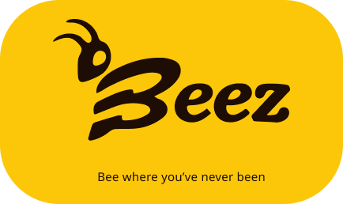

  

O Beez é uma aplicação mobile (inicialmente desenvolvida apenas para Android) que tem como objetivo unificar eventos de entretenimento/recreação em um só lugar.

Por meio dele, pessoas podem visualizar e cadastrar eventos de qualquer natureza (lazer, religiosos, artísticos, culturais), manifestar interesse na participação, seguir produtores de eventos e seus amigos, além de ficar por dentro de tudo que está acontecendo na sua cidade (ou em outras).

## Arquitetura

O sistema foi projetado usando um Serverless Backend com Firebase. Dessa forma, podemos implementar features de Realtime Database e evitando que um backend a parte tenha de ser construído, já que as tarefas que necessitam de persistência são básicas.
